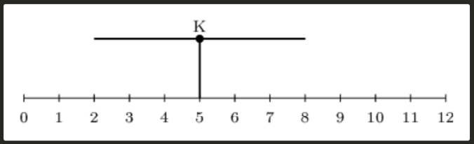
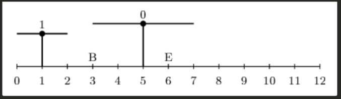
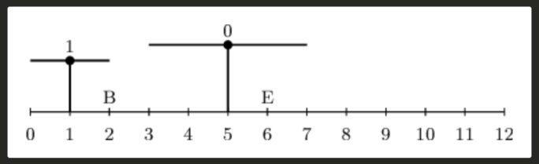
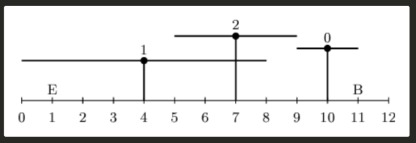

There are `N` cranes (numbered from `0` to `N-1`) arranged in a line along a road. Road begins at position `0`. The `K-th` crane is located at distance `P[K]` from the beginning of the road and its arm length is equal to `A[K]`. The cranes cannot change their positions.<br>
There is a package, initially located at position `B`, that has to moved by the cranes to position `E`.<br>
The `K-th` crane can pick up the package only if the distance between its position and the package position is less than or equal to `A[K]` (the package is within arm range from the crane's position).<br>
A package can be moved by crane to and arbitrary position within the crane's arm reach (between `P[K] - A[K]` and `P[K] + A[K]` for the `K-th` crane).<br><br>
For example, if `P[K] = 5` and `A[K] = 3`,the `K-th` crane can move packages anywhere between positions `2` and `8`, including both of the boundaries.<br>
.<br>


Determine whether it is possible to move the package from position `B` to position `E` using some (possibly all) of the cranes. Any crane can be used an arbitrary number of times.<br>
Write a function :
```go
func Solution(A []int, P []int, B int, E int) bool
```
that, given to arrays of integers `A` and `P`, both of length `N`, and two integers `B` and `E`, returns `true` if the package can be moved from position `B` to position `E` using the cranes described by arrays `A` and `P` and `false` otherwise .<br>
### Examples:
1. Given `A=[2,1]`, `P=[5,1]`, `B=3`, `E=6`, your function should returns `true` . The crane number zero can move the package from position `3` to `6` directly.<br> 
<br><br>

2. Given `A=[2,1]`, `P=[5,1]`, `B=2`, `E=6`, your function should returns `false`. The crane number zero cannot reach the package at its initial position. The crane number one can move it from position `2` any position between `0` and `2`. The crane number zero still will not be able to reach package at any of these position, so it is not possible to move package to position `6`.<br>
<br><br>

3. Given `A=[1,4,2]`, `P=[10,4,7]`, `B=11`, `E=1`, your function should returns `true`. The package can, for example, be moved by the crane number zero, from position `11` to `9`, then by crane number two from position `9` to `7` and finally from position `7` to `1` by the crane number one .<br>
<br><br>

3. Given `A=[5,5,1]`, `P=[3,3,6]`, `B=11`, `E=1`, your function should returns `true`. Notice that the first two cranes are identical. We can use the crane number one to move the package directly from position `4` directly to position `8`.